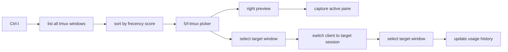

# tmux-fzf

A small tmux plugin for switching windows across sessions with `fzf-tmux`.

## Features

- `Ctrl-l`: open a window picker across all tmux sessions
- `Ctrl-h`: jump back to the previous window
- Sort windows by frecency-like history
- Preview the current active pane on the right side
- Keep ANSI colors in preview output
- Use exact search instead of fuzzy search

## Requirements

- `tmux`
- `fzf-tmux`

Check `fzf-tmux`:

```bash
which fzf-tmux
```

## Install

With [TPM](https://github.com/tmux-plugins/tpm):

```tmux
set -g @plugin 'edte/tmux-fzf'
```

Then reload tmux config and install plugins:

```bash
tmux source-file ~/.tmux.conf
```

Inside tmux:

```bash
prefix + I
```

## Key Bindings

```text
Ctrl-l  Open window picker
Ctrl-h  Jump to previous window
```

## Search Behavior

The picker uses `fzf --exact`.

That means:

- input must appear as a continuous substring
- it does not use fuzzy matching
- match highlight color is `#FF4500`

Examples:

- `manage` matches `push-manage-console`
- `mnge` does not match `push-manage-console`

## Sort Behavior

The picker sorts windows before they are passed to `fzf`.

Current sort strategy:

- windows used more recently get a higher score
- windows used more frequently also get a higher score
- recent usage has stronger weight than old usage
- `fzf` is only used for filtering and selection

Usage history is updated after successful jumps from:

- `Ctrl-l`
- `Ctrl-h`

## Preview Behavior

The right preview window shows the current visible content of the target window's active pane.

Current behavior:

- only previews the active pane
- only captures visible pane content
- trims trailing blank lines
- keeps ANSI colors
- preview background is styled separately from the left list

## How It Works



## Files

- `main.tmux`: register key bindings
- `scripts/switch_window.sh`: open picker and switch window
- `scripts/preview_pane.sh`: render preview content
- `scripts/last_window.sh`: jump back to previous window
- `scripts/sort_windows.sh`: sort windows before `fzf`
- `scripts/update_history.sh`: record window usage history

## Notes

- The previous window state is stored in `/tmp/tmux_previous`
- Usage history is stored in `~/.local/state/tmux-fzf/window_events.tsv`
- Usage summary is stored in `~/.local/state/tmux-fzf/window_stats.tsv`
- Preview quality depends on how tmux captures pane content from terminal apps

## Reference

- https://github.com/sainnhe/tmux-fzf
- https://github.com/Kristijan/fzf-pane-switch.tmux
