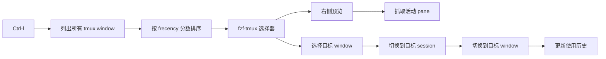

# tmux-fzf

[English README](./README.md)

一个基于 `fzf-tmux` 的小型 tmux 插件，用来在不同 session 的 window 之间快速切换。

## 功能

- `Ctrl-l`：打开所有 tmux session 的 window 选择器
- `Ctrl-h`：跳回上一个 window
- 按近因频率（frecency）对 window 排序
- 右侧预览目标 window 的当前活动 pane
- 预览保留 ANSI 颜色
- 搜索使用精确匹配，不使用模糊匹配

## 依赖

- `tmux`
- `fzf-tmux`

检查 `fzf-tmux`：

```bash
which fzf-tmux
```

## 安装

使用 [TPM](https://github.com/tmux-plugins/tpm)：

```tmux
set -g @plugin 'edte/tmux-fzf'
```

然后重新加载 tmux 配置并安装插件：

```bash
tmux source-file ~/.tmux.conf
```

在 tmux 里执行：

```bash
prefix + I
```

## 快捷键

```text
Ctrl-l  打开 window 选择器
Ctrl-h  跳回上一个 window
```

## 搜索行为

当前选择器使用 `fzf --exact`。

这意味着：

- 输入内容必须在候选项里连续出现
- 不使用模糊匹配
- 匹配高亮颜色是 `#FF4500`

示例：

- `manage` 可以匹配 `push-manage-console`
- `mnge` 不能匹配 `push-manage-console`

## 排序行为

在把候选项交给 `fzf` 之前，插件会先对 window 排序。

当前排序策略：

- 最近使用过的 window 分数更高
- 使用次数更多的 window 分数也更高
- 最近使用的权重高于较早以前的使用记录
- `fzf` 只负责过滤和选择，不再负责重新排序

以下操作成功切换后会更新历史：

- `Ctrl-l`
- `Ctrl-h`

## 预览行为

右侧预览窗口显示目标 window 当前活动 pane 的可见内容。

当前行为：

- 只预览活动 pane
- 只抓取当前可见内容
- 会去掉尾部空白行
- 保留 ANSI 颜色
- 右侧预览区背景单独设置，不影响左侧列表

## 工作原理



## 文件说明

- `main.tmux`：注册快捷键
- `scripts/switch_window.sh`：打开选择器并切换 window
- `scripts/preview_pane.sh`：生成右侧预览内容
- `scripts/last_window.sh`：跳回上一个 window
- `scripts/sort_windows.sh`：在 `fzf` 前先排序
- `scripts/update_history.sh`：记录 window 使用历史

## 说明

- 上一个 window 状态保存在 `/tmp/tmux_previous`
- 使用历史保存在 `~/.local/state/tmux-fzf/window_events.tsv`
- 使用汇总保存在 `~/.local/state/tmux-fzf/window_stats.tsv`
- 预览效果会受到 tmux 抓取终端应用内容方式的影响

## 参考

- https://github.com/sainnhe/tmux-fzf
- https://github.com/Kristijan/fzf-pane-switch.tmux
- https://github.com/camdencheek/fre
